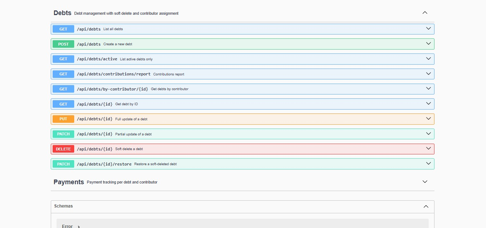

# Personal Finances API

> REST API for managing personal debts and payments with multi-contributor tracking. Built with **Node.js**, **Express**, and **PostgreSQL** following a clean MVC architecture. Includes soft delete, contributor reports, and interactive API documentation.

[](https://personal-finances-backend.onrender.com/docs)


---

## Preview



---

## Highlights

- **Multi-contributor debt tracking** — each debt is assigned to one or more contributors via a many-to-many relationship; contributors are created automatically if they don't exist (`connectOrCreate`)
- **Soft delete + restore** — debts are never permanently removed; `is_deleted` flag preserves data integrity with a dedicated restore endpoint
- **PUT vs PATCH differentiation** — full replacement and partial update are separate endpoints with independent validation middleware
- **Contribution validation** — the sum of all contributor amounts must equal `monthly_payment` before a debt is accepted
- **Contributions report** — aggregate endpoint showing total owed per contributor across all active debts
- **Interactive docs** — full OpenAPI 3.0 spec served via Swagger UI at `/docs`

---

## Table of Contents

- [Tech Stack](#tech-stack)
- [Project Structure](#project-structure)
- [API Endpoints](#api-endpoints)
- [Prerequisites](#prerequisites)
- [Local Setup](#local-setup)
- [Environment Variables](#environment-variables)
- [Available Scripts](#available-scripts)
- [License](#license)

---

## Tech Stack

| Layer | Technology |
|---|---|
| Runtime | Node.js 18+ |
| Framework | Express.js v5 |
| Database | PostgreSQL (Neon) via Prisma ORM v6 |
| Module System | ES Modules (ESM) |
| API Docs | Swagger UI + OpenAPI 3.0 |

---

## Project Structure

```
personal-finances-backend/
├── prisma/
│   ├── schema.prisma        # Data models: Debt, Contributor, DebtContributor, Payment
│   └── seed.js              # Sample data for development
├── docs/
│   └── openapi.yaml         # OpenAPI 3.0 specification
├── src/
│   ├── config/
│   │   └── db.js            # Prisma client singleton
│   ├── controllers/         # HTTP request/response handling
│   │   ├── debtController.js
│   │   └── paymentController.js
│   ├── services/            # Business logic and Prisma queries
│   │   ├── debtService.js
│   │   └── paymentService.js
│   ├── routes/              # Endpoint definitions
│   │   ├── debtRoutes.js
│   │   └── paymentRoutes.js
│   ├── middlewares/         # Validation per operation (POST, PUT, PATCH)
│   │   ├── validateDebt.js
│   │   ├── validateDebtFullUpdate.js
│   │   ├── validateDebtPartialUpdate.js
│   │   └── errorHandler.js
│   ├── app.js               # Express setup + Swagger UI
│   └── server.js            # Server bootstrap
└── Dockerfile
```

---

## API Endpoints

### Debts

| Method | Endpoint | Description |
|---|---|---|
| GET | `/api/debts` | List all debts |
| GET | `/api/debts/active` | Active debts only (`is_deleted = false`) |
| GET | `/api/debts/contributions/report` | Contribution totals per contributor |
| GET | `/api/debts/by-contributor/:id` | Debts assigned to a contributor |
| GET | `/api/debts/:id` | Full debt detail with contributors and payments |
| POST | `/api/debts` | Create debt with contributors |
| PUT | `/api/debts/:id` | Full update (all fields required) |
| PATCH | `/api/debts/:id` | Partial update (any field) |
| DELETE | `/api/debts/:id` | Soft delete (`is_deleted = true`) |
| PATCH | `/api/debts/:id/restore` | Restore a soft-deleted debt |

### Payments

| Method | Endpoint | Description |
|---|---|---|
| GET | `/api/payments` | List payments (filters: `debtId`, `contributorId`, `status`) |
| GET | `/api/payments/debt/:debtId` | Payments for a specific debt |
| GET | `/api/payments/:id` | Payment detail |
| POST | `/api/payments` | Register a payment |
| PATCH | `/api/payments/:id` | Update payment status or amount |
| DELETE | `/api/payments/:id` | Delete a payment |

### Create Debt — Request Body

```json
{
  "debt_name": "Banco Continental - Préstamo personal",
  "creditor_name": "Banco Continental",
  "amount": 10000.00,
  "installments": 24,
  "monthly_payment": 500.00,
  "due_date": "2027-01-15",
  "contributors": [
    { "name": "Yuliana", "contribution_amount": 300.00 },
    { "name": "Carlos",  "contribution_amount": 200.00 }
  ]
}
```

> The sum of `contribution_amount` across contributors must equal `monthly_payment`.
> Contributors are created automatically if they don't exist.

---

## Prerequisites

- Node.js 18+
- PostgreSQL (or a [Neon](https://neon.tech) account)

---

## Local Setup

```bash
# 1. Clone the repository
git clone https://github.com/YulianaGP/personal-finances-backend.git
cd personal-finances-backend

# 2. Install dependencies
npm install

# 3. Set up environment variables
cp env.example .env
# Edit .env with your DATABASE_URL

# 4. Push schema to database
npx prisma db push
npx prisma generate

# 5. (Optional) Seed with sample data
npm run seed

# 6. Start the development server
npm run dev
```

Server runs at `http://localhost:3000` — API docs at `http://localhost:3000/docs`.

---

## Environment Variables

| Variable | Description | Required |
|---|---|---|
| `DATABASE_URL` | PostgreSQL connection string (Neon) | Yes |
| `PORT` | Server port | No (default: 3000) |
| `CLIENT_URL` | Allowed CORS origin | No (default: `http://localhost:5173`) |

---

## Available Scripts

```bash
npm run dev       # Start server with nodemon (auto-reload)
npm start         # Start server in production mode
npm run seed      # Seed database with sample data

npx prisma db push      # Sync schema with database
npx prisma generate     # Regenerate Prisma client
npx prisma studio       # Open Prisma Studio (visual DB editor)
```

---

## License

MIT — free for personal and commercial use.
